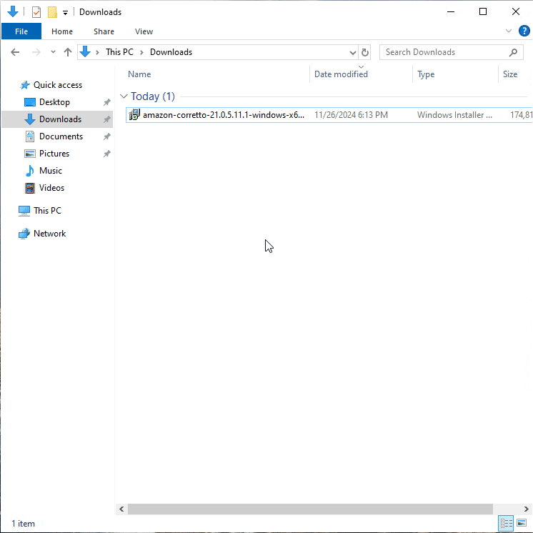
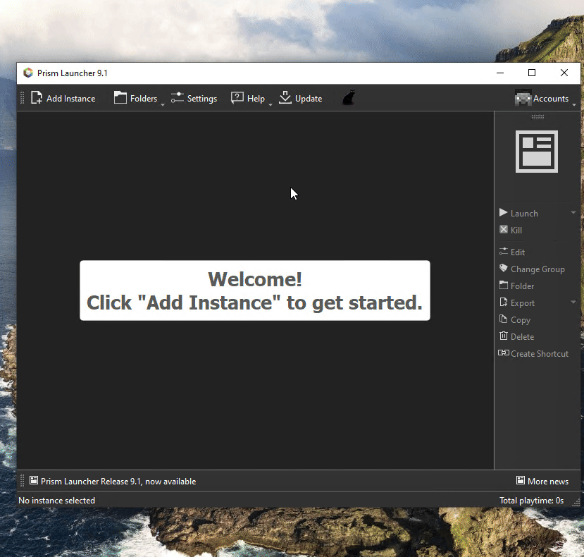

# Java telepítése

Mielőtt bármilyen launchert telepítenél, szükséged van a megfelelő **Java** verzióra.
A szerver **Minecraft 1.21+** verziót futtat, amihez **Java 21** kell.

---

## Letöltés

Töltsd le a Java 21-et az alábbi gombbal:

[:material-download: Java 21 letöltése (Adoptium)](https://adoptium.net/temurin/releases/?version=21){ .md-button .md-button--primary }

!!! tip "Melyiket válaszd?"
    - **Operációs rendszer:** Windows
    - **Architektúra:** x64 (általában ez kell)
    - **Csomag típusa:** Installer (`.msi`)

---

## Telepítés lépései és a Java verzió kiválasztása





!!! warning "Figyelem"
    Ha már volt telepítve régebbi Java, attól **nem kell** eltávolítani – több verzió egymás mellett is futhat.

1. Nyisd meg a letöltött `.msi` fájlt
2. Kattints a **Next** gombra végig
3. A telepítés végén kattints a **Finish** gombra

---

## Ellenőrzés

Telepítés után nyiss egy **Command Prompt**-ot (`Win + R` → `cmd`) és írd be:

```
java -version
```

Ha valami ilyesmit látsz, minden rendben van:

```
openjdk version "21.0.x" ...
```

---

!!! success "Kész!"
    A Java telepítve van. Következő lépés: válassz launchert!

    [:octicons-arrow-right-24: Launcher választás](launcher.md){ .md-button }
